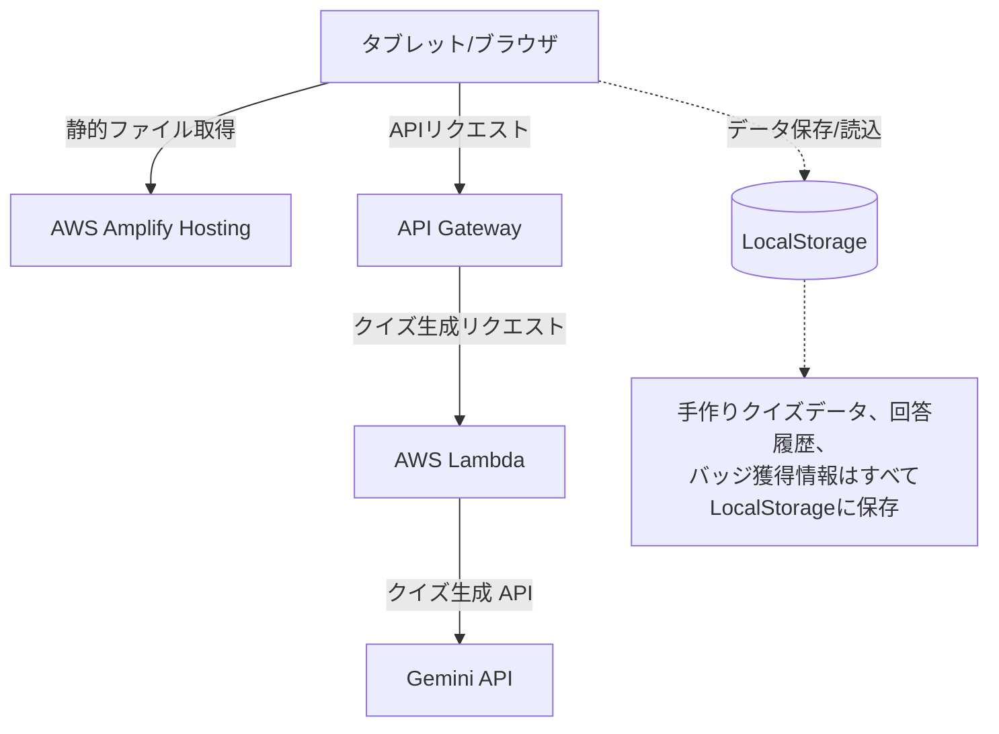

# 宇宙クイズ-AI 要件定義書

本ドキュメントは、宇宙が好きな子ども向けのクイズアプリケーション「宇宙クイズ-AI」のシステム要件定義書です。

---

## 1. アプリケーション概要
* **アプリ名**: 宇宙クイズ-AI
* **ターゲット層**: 宇宙が大好きな未就学児（4〜6歳）、小学校低学年（7〜9歳）
* **想定デバイス**: タブレット（iPad、Androidタブレット等）でのタッチ操作に最適化したWebアプリ

---

## 2. クイズモード構成（親子のコミュニケーション）
本アプリは、AIによる無限のクイズと、大人が作成する手作りのクイズの2つのモードを提供します。

1. **AI（エーアイ）の ひみつクイズ** (AI自動生成モード)
   * 毎回AIがその場で新しいクイズを生成して出題するモード。新鮮な知識や驚きを提供します。
2. **おとうさん・おかあさんの クイズ** (大人手動作成モード)
   * 親や先生が事前に作成した手作りクイズを出題するモード。親子の対話や、子どものレベルに合わせたパーソナライズされた出題が可能です。

---

## 3. システム構成（AWSサーバーレス構成）
インフラの管理コストをゼロにし、ランニングコストを極限まで抑えるための構成です。

* **フロントエンド**: AWS Amplify Hosting
  * 静的なHTML/CSS/JavaScriptを配信（独自ドメイン不要、自動付与ドメインを使用）。
* **バックエンド**: API Gateway + AWS Lambda
  * AIへのクイズ生成リクエスト中継、自動検証（バリデーション）などを担当。
* **AI・LLM**: **Gemini 1.5 Flash** (または 2.0 Flash)
  * 低遅延・低コスト（無料枠あり）でクイズを生成。
* **データ保存**: クライアントサイド `LocalStorage`
  * ユーザーの識別やサーバーサイドのDBは一切持たず、すべてのデータ（作成したクイズ、回答履歴、獲得したごほうびバッジ）はブラウザに保存します。

---

## 4. 機能要件

### 4.1 クイズ機能
* **問題数**: 1回につき5問をランダムに出題。
* **選択肢**: 3者択一形式。
* **難易度**: タイトル画面で3段階から選択。
  * **やさしい**（未就学児向け）: テキストはすべて「ひらがな・カタカナ」のみ。直感的な知識。
  * **ふつう**（小学校低学年向け）: 簡単な漢字を使用するが、すべての漢字にルビ（ふりがな）を振る。
  * **むずかしい**（ふつうが簡単に感じる子ども向け）: 少し大人向けの宇宙知識。漢字にルビを振る。
* **ルビ振り形式**: HTMLの `<ruby>` タグを利用。
  * 例: `<ruby>宇宙<rt>うちゅう</rt></ruby>`
* **解説の表示**: 回答後、正誤に関わらず「せいかい！」「ざんねん！」のアニメーションと共に、子ども向けに噛み砕いた解説テキストを表示。

### 4.2 AI生成クイズのハルシネーション（嘘）対策
AIのリアルタイム生成における誤情報や不適切な表現を防ぐため、Lambda（バックエンド）にて以下の自動検証を行います。
1. **構造化データ制御 (Structured Outputs)**: Geminiから厳密なJSONフォーマット（問題、選択肢3つ、正解インデックス、解説）で取得。システムプロンプトで「宇宙の確定した科学的事実のみに基づき、ファンタジーや仮説は除外すること」を指示。
2. **プログラムによる自動バリデーション**:
   * 正解インデックスが0〜2の範囲内にあるか。
   * 選択肢のテキストに重複がないか。
   * 難易度ルール（ひらがな中心か、ルビが含まれているか）に適合しているか。
3. **サイレント・リトライ**: 検証に失敗した場合、ユーザーにはローディング画面を見せたまま裏で即座に再生成を行います。Gemini 1.5 Flashの高速性を活かし、数秒以内での安定したクイズ出題を実現します。

### 4.3 おとうさん・おかあさんのクイズ作成機能
* **おとな用ページへの入場制限（保護者ゲート）**:
  * 子どもの誤操作を防ぐため、簡単な算数問題（例: `7 + 8 は？`）に回答できた場合のみ、クイズ作成・管理画面に入場できます。
* **手作りクイズ作成**:
  * 問題文、選択肢3つ、正解の選択、解説を入力し、`LocalStorage` に保存。
  * 作成したクイズはいつでも編集・削除が可能。
* **クイズ共有コード（オプション）**:
  * 作成したデータを別の端末に移動できるよう、暗号化/圧縮したテキストコードとしてコピー＆ペーストできる簡易インポート/エクスポート機能。

### 4.4 セーブデータとリセット機能
* **回答履歴の保存**:
  * 一度答えたクイズのID（またはハッシュ）を `LocalStorage` に保存し、次回の出題リストから除外（再出題の防止）。
* **はじめからあそぶ（リセット）**:
  * おとな用ページ等から回答履歴のみを削除し、再びすべての問題が最初から出るようにリセット可能。この際、大人が登録した「てづくりクイズ」自体は消去されません。

### 4.5 ごほうび（コレクション）要素
* **うちゅうバッジの獲得**:
  * クイズを5問クリアするごとに、ランダムで「うちゅうバッジ」（「ちきゅうバッジ」「どせいバッジ」「ロケットスタンプ」など）を1つ獲得。
* **コレクションルーム**:
  * 獲得したバッジはコレクション画面でいつでも眺めることができ、コンプリートを目指すモチベーションを生み出します。

---

## 5. UI/UX デザインの基本方針
* **タブレット最適化**:
  * 3択ボタンは画面の大部分を占める巨大なサイズで配置し、誤タップを防ぐためボタン間の余白を十分に確保。
* **視覚効果**:
  * 宇宙をイメージしたダークブルーやネオンカラー（星の光をイメージしたグラデーション）をベースにしつつ、文字は読みやすい高コントラストな配色。
  * 正解・不正解時のワクワクするアニメーション演出。

---

## 6. 今後の開発ロードマップ
1. **フロントエンド・モックアップ作成**: ローカル環境でHTML/CSS/JSによる画面遷移とデザインを実装（LocalStorageによる手作りクイズ・リセット・バッジのプロトタイプ確認）。
2. **Lambda API構築**: Gemini APIと連携したクイズ生成とバリデーション部分の構築。
3. **AWSデプロイ**: AWS Amplify HostingおよびAPI Gateway/Lambdaへの配置と疎通テスト。
